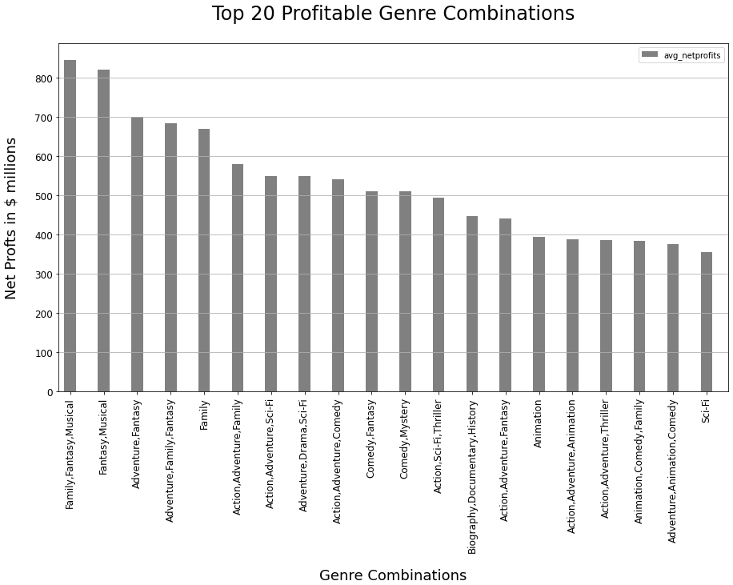
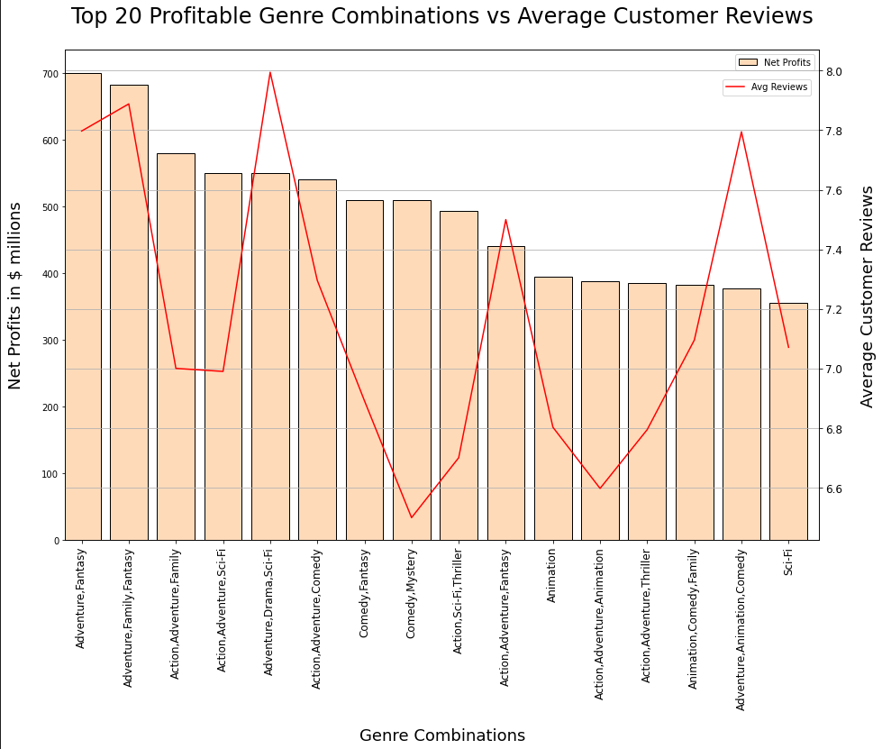
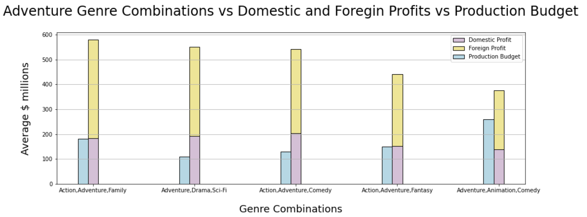

# Microsoft Studio Project

# Final Project Submission

* **Student name:** Shayan Abdul Karim Khan
* **Student pace:** Self Paced
* **Scheduled project review date/time:**  Friday Aug 26th 2022
* **Instructor name:** Abhineet Kulkarni
* **Blog post URL:** 

## Problem Overview

A lot of companies are producing original video content generating huge revenues, including box office movies. 
Microsoft has decided to venture into the world of movie production with a new movie studio. In order to make the movie studio a success, Microsoft needs to understand what kind of movies to produce. 

Microsoft has 3 goals that this project focuses on:
1. Positive viewer response
2. Domestic vs Foreign Launch
3. Profitable 

### Business Questions
This notebook focused on three business questions

1. Which genres to focus on?

2. Should the movie be launched internationally?

3. What should be the expected budget/initial investment?

## Strategy

Movie Reviews and Movie Profits were used as KPIs to answer the three main business questions in the following manner:

1. Which genres to focus on?
    - genre vs average reviews analysis
    - genre vs profit analysis
    - genre vs average reviews vs profit analysis
 

2. Should the movie be launched internationally?
    - genre vs domestic profit analysis
    - genre vs foregin profit analysis
 

3. What should be the expected budget/initial investment?
    - genres vs production budget vs domestic & foreign profits analysis

## Data Sources

5 data sources were initially explred: 

- **[Box Office Mojo](https://www.boxofficemojo.com/)**

- **[The Numbers](https://www.the-numbers.com/)**

- **[Rotten Tomatoes](https://www.rottentomatoes.com/)**

- **[IMDB](https://www.imdb.com/)**

- **[TheMovieDB](https://www.themoviedb.org/)**

## Data Understanding

### Box Office Mojo Dataset

The Box Office Mojo dataset mainly had financial data about gross foreign and domestic revenue with `3387` records. After comparison with **The Numbers** dataset it was decided to choose **The Numbers** dataset because it had mrooe records.

### The Numbers Dataset

This dataset contains the same financial information as the **Box Office Mojo** dataset but with more records, totalling `5782`. It also has the additional infoormation obout productin budget therefore this dataset was chosen for financial analysis.

### Rotten Tomatoes Dataset
There are 2 datasets from Rotten Tomatoes that we are going to explore and understand their utility for our analysis.

- `rt.movie_info.tsv` with `1560` records has basic informaation about movies such as genre, director, writer, etc.
- `rt.reviews.tsv` with `54432` records has the corresponding user reviews for tmovies.

The two datasets are related through the id column as shown below. Since there are multiple reviews for movies, we see a big discrepancy between the total number of records between the two datasets.

This dataset was not used because the `IMDB` database has the same information but more records.

### IMDB Database

We have the following Entity Relationship Diagram (ERD) explaining the different tables in the database:

The `persons` table contains the records for the cast and crew of the movies which are not relevant to the business questions that this notebook explore therefore they were ignored.

Leveraging the **ERD** above, we skipped exploring `writers`, `directors`, `principals` and `known_for` tables because these are information about the cast and crew.

The `movie_basics` table give us the principal information about the movies that will be used for joining and relating with other tables. It will be important to use this table in analysis to relate reviews and profits to genres.

The `movie_ratings` table will be extremely valuable in analyzing genres vs reviews and generating recommendations for which type of movie should the client pursue.

This is the dataframe storing the average reviews for the movies and the corresponding total number of votes for each movie. 

These reviews can be correlated with the genres of the movies from `movie_basics` using the `movie_id` column. This will give us a good comparison of genres vs reviews.

These can be further analysed with profits for every movie, resulting in a genres vs reviews vs profits comparison.

`movie_akas` is a relatively large dataframe with `331703` records. This is because the `title` column has separate names that movies had in different regions. 

The are `44700` original titles in this dataset but almost all of them are missing region and lanaguage data.

This renders this table invaluable for our analysis since it doesn't have any extra information that will help answer the **Business Questions**

### The MovieDB Dataset

Tis dataset will be very useful for analyzing movie reviews vs proftis vs genres. We can directly link this dataset to the IMDB tables using the `original_title` column. We will average out the reviews from this dataset and the IMDB dataset.

Lets take an overall look at the ERD of all of our datasets and talk about which ones we will be using in our analysis, and how we'll use them.
In the diagram below, yellow is for the **IMDB** database. Everything else is labelled.

## Data Interpretation and Visualizations

### Which genres bring in the highest ratings and profits?

#### genre vs ratings analysis:

We can easilly decypher that the top 4 most popular genre combinations that are rated above average are (Recall that **NA** means that there wasn't a combination for thata column:

1. `Drama`
2. `Adventure, Animation, Comedy`
3. `Comedy, Drame` tied with `Documentary`
4. `Action, Adventure, Sci-fi`

Nonetheless, purely good reviews can't be only reference of producing a successful movie. It needs to be looked at from the financial lens also. For this purpose, we will look at genre vs profits analysis next.

### genre vs profits analysis

The figure above shows the Top 20 profitable genre combinations.

The most common genre in the top 10 are 
1. Adventure with 10 groupings
2. Action with 7 groupings
3. Fantasy with 6 groupings
4. Family with 5 and Comedy with 5 groupings
5. Animation with 4 and Sci-fi with 4 groupings
6. Musical with 2 and Thriller with 2 groupings
7. Drama, Mystery, Documentary, History with 1 groupings each

We can see that `Adventure` is the big common between these two analysis with **ten** highly profitable combinations. 

`Documentary` and `Drama` only had a **single** combination to their names so we can ignore them because we want to investigate movies that have a high chance of getting good reviews and making a good profit. With only one occurance it greatly reduces the chances of being a profitable venture with either of those genres. 

We did see `Animation` and `Comedy` pop up in the top 10 profitable category with **four** aand **five** combinations.

We also saw `Action` and `Sci-fi` in the race with **seven** and **four** combinations respectively.

We can also see that `Family` and `Fantasy` are up there but our previous analysis showed us that the chances of these movies getting high viewer ratings is low so we are not going to focus on them.

This tells us that we should keep an eye out for the following three categories going forward:

1. `Adventure`
2. `Action`
3. `Comedy`
4. `Animation`
5. `Sci-fi`

### genre vs ratings vs profits analysis

We will focus on the 5 genres that we have shortlisted and their combinations.

Recapping the 5 genres we shortlisted:

1. `Adventure`
2. `Action`
3. `Comedy`
4. `Animation`
5. `Sci-fi`

We can clearly see some good and bad spikes in the graph:

- `Adventure` is the common genre in all the 5 peaks of movie ratings with the grouping of `Fantasy` in 3 of them.

- In the 8 groupings with 7 or below average ratings, `Adventure` was a part of 4 of them which shows that `Adventure` genre on it's own is a mixed fortune. It is the pairings with `Adventure` that play a big part.

- 4 out of the 7 groupings of `Action` ended up having an average rating of 7 or less. That shows that it is difficult to generate good customer reviews with this genre. In all the 3 groupings that were above 7 were with `Adventure`. We will continue to explore `Action` but in context of pairing with `Adventure`

- `Comedy` faired better with 3 out of 5 combinations racking up average ratings higher than 7 in the most profitable combinations. Out of these 3, 2 were pairings with `Adventure`

- `Animation` had an average performance with 2 out of 4 combinations getting above 7 ratings. Both of these were paired with `Comedy`. We will be looking at `Animation` in combination with `Comedy` pairings for better insights going forward.

- `Sci-Fi` did really good on its own or when paired wiht with `Adventure` and `Drama`. Pairings with `Action` proved to bring down the ratings. We will continue to explore `Sci-Fi` as a possible pairing with `Adventure` or other genres.

In light of these insights, we will shift our focus to looking at pairings with `Adventure` and the following genres:

1. `Action`
2. `Comedy`
3. `Animation` 
4. `Sci-Fi`

We will take a look at foreign success and movie budgets next to understand what pairings will prove to be the best with `Adventure`.

### Should the movie be launched internationally?

Similar to the last analysis, we will cut down our shortlist to the 5 genres and minimumm average rating of 7 to pick out the top genre combinations. Then we will evaluate how did these genres perform in the foreign and domestic markets.

This chart makes it clear that the launch of a movie in foreign merkets is essential to have high profitability and success. In most of the genre combinations, the foreign profits are eiher dominating the total profits or contributing as much as the domestic profits. 

Lets see how have our shortlisted genres done in domestic and foreign markets:

The `Adventure` genre has consistently brought in almost $200 million profits in the US market.

The most repeated combination with `Adventure` has been of `Action` with 3 out of the 5 shortlisted.

The next most repeated one has been with `Comedy` with 2 combinations.

`Sci-Fi` and `Animation` both had a single combination each with `Adventure`.

The combination with `Sci-Fi` was the highest rated amongst all 5 aand a close second for net profit with almost $550 million.

Interestingly, the combination of `Action, Adventure, Comedy` didn't end up being the most profitable or the best reviewed amongst the 5 but those are the 3 genres which are showing up to be the most consistent in performance. But this combination did bring in the highest domestic profit amongst the shortlisted genres. Therefore, if he client chooses to not pursue an international launch, this cmbination would be the most reliable to bring in high domestic profits.

To finally choose which combination will work best, we still need to look at the production budget required for these genres. This will provide the client insight on which genre to choose depending on the money available to the client.

### What should the budget target be for the movie?

The highest production budget with the lowest profits was the combination of `Adventure, Animation, Comedy` which rules it out of selection.

The lowest production budget was for `Adventure, Drama, Sci-Fi` and then `Action, Adventure, Comedy` with only a small difference between the two. Both of these genres have similar net profits therefore the financial impacts will also be similar.

This gives the client options on which genre combination to choose from for pursuing the most financially sound option.

## Conclusion and Recommendation

The recommendations from the analysis is the following:

`Action, Adventure, Comedy` : 
    - Net Profit: ~$525 million
        - This is the least amount of net profit amongst the final three options. 
        - All of the three genres in this combination were a consistent occurance in the top 20 most profitable genre combinations.
    - Average Rating: ~7.3
        - All of the three genres were the most consistent genres to show up for high average ratings and high proftiability which means that they can garner a lot of **positive viewer response** and be highly **profitable**
    - Production Budget: ~$150 million
        - This is the second highest production budget from the final 3 options.

**Domestic vs Foreign Launch** The financial performance in domestic and foreign markets of the 3 options is given below:

    1. `Action, Adventure, Family` : 
        - Barely break even. Most of the profits are from international markets
        - Cannot pursue

    2. `Adventure, Drama, Sci-Fi` :
        - Domestic profit of ~$200 million.
        - Foreign profit of ~$350 million.

    3. `Action, Adventure, Comedy` :
        - Domestic profit of ~$200 million.
        - Foreign profit of ~$325 million.
        
        
This shows that for a profitable success, international markets can not be ignored and have to be catered t
        
With all of that in mind, the final recommendation would be to pursue a film in the genre commbination of `Action, Adventure, Comedy`. 

This is because it will meet all 3 of the client's goals. These 3 genres are most common occurances in the high customer reviews list and the most profitable genres list. This increases the statistical chances of the movie having high **profits** and high **positive viewer responses**.

## Links:
1. Click [here](https://github.com/shayanabdulkarimkhan/dsc-phase-1-project-v2-4/blob/1999d435cafcc4e55b3c26778b84b0877e38c0b0/Microsoft%20Movie%20Studio%20Project.ipynb) to see the full analysis: 
2. Click [here](https://github.com/shayanabdulkarimkhan/dsc-phase-1-project-v2-4/blob/1999d435cafcc4e55b3c26778b84b0877e38c0b0/Microsoft_Studios_Project.pdf) to see the overview presentation.

